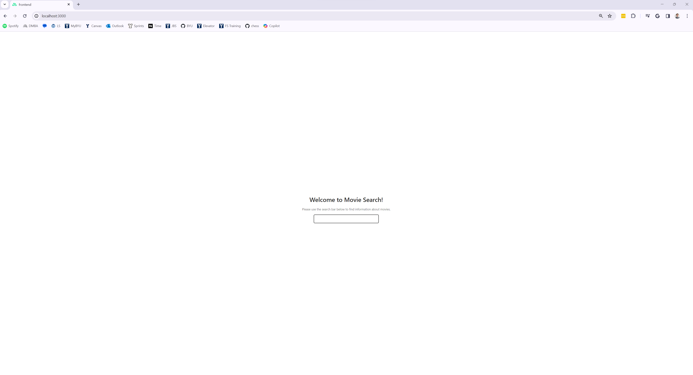

# Movie Search Web App
Welcome to the Movie Search web app! This project allows users to search for information about movies using the TMDB API.




## Running the Backend

To run the backend server, follow these simple steps:

1. Open a terminal window and navigate to the root directory of the project.
2. Install the required Node.js modules by running: ```npm install```
3. Create a `.env` file in the root directory and add your TMDB API key to the file as follows: ```API_KEY=your_api_key_here```
4. Start the backend server by running the command:```node index.js``` 

The backend server will start on port 4000 and can be accessed at http://localhost:4000/movies

## Running the Frontend

1. Open another terminal window and navigate to the frontend directory of the project.
2. Install the required Node.js modules by running the command: ```npm install```
Start the frontend server by running the command: ```npm run dev```
3. The frontend server will start on port 3000 and can be accessed at http://localhost:3000.

That's it! Now you can use Movie Search web app on your local machine. Happy movie searching! 🍿🎬